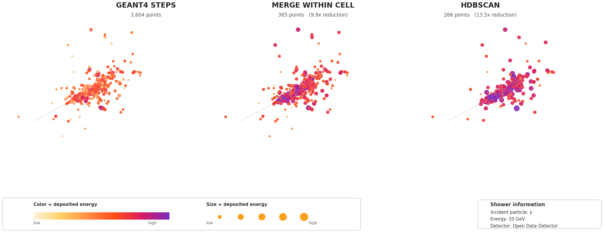

<!-- Profile README of the GitHub organization fast-sim.
     Lives in the repository fast-sim/.github at profile/README.md and is
     shown at the top of https://github.com/fast-sim. -->
<!-- TODO: group / affiliation line, and the org display name and avatar
     (organization settings), as in https://github.com/FLC-QU-hep -->

# Fast calorimeter simulation

Tools and studies for fast simulation of calorimeter showers: detailed
Geant4 / DD4hep simulation, compact point-cloud representations of the showers,
and their use as input to machine-learning-based fast simulation.
Trained weights are on [Hugging Face](https://huggingface.co/fast-sim).

  
   
  <em>One photon shower as Geant4 steps and after two step2point compressions
  (made with <a href="https://github.com/fast-sim/step2point/blob/main/examples/render_shower_display.py"><code>render_shower_display.py</code></a>).</em>

## Publications and code

Most recent first, by arXiv date.

| Paper | Journal | Code | Data and weights |
|---|---|---|---|
| step2point dataset: Detailed shower simulation for data representation studies, [arXiv:2509.22340](https://arxiv.org/abs/2509.22340) ([CDS](https://cds.cern.ch/record/2948746)) | | [`step2point`](https://github.com/fast-sim/step2point) | Zenodo, [doi:10.5281/zenodo.17199427](https://doi.org/10.5281/zenodo.17199427) |

## Datasets

| Dataset | Content | Where |
|---|---|---|
| step2point dataset (2025) | Detailed (Geant4 step-level) simulation of electromagnetic and hadronic showers in the Open Data Detector calorimeters, for studies of shower data representations | Zenodo, [doi:10.5281/zenodo.17199427](https://doi.org/10.5281/zenodo.17199427) |

## Repositories

| Repository | Content |
|---|---|
| [`step2point`](https://github.com/fast-sim/step2point) | Library for compressing calorimeter shower data (x, y, z, E) into point clouds while preserving key physics observables. [Documentation](https://fast-sim.github.io/step2point/) |
| [`ddFastSim`](https://github.com/fast-sim/ddFastSim) | Plugins for fast simulation with DDG4, starting with a replication of the Geant4 `extended/parameterisations/Par04` example |
| [`DDsimTutorialApplication`](https://github.com/fast-sim/DDsimTutorialApplication) | Reproduction of the thin-target Geant4 tutorial application with DD4hep simulation (DDSim) |
| [`showerRepresentationStudies`](https://github.com/fast-sim/showerRepresentationStudies) | Tools to analyse shower data for data-representation optimisation in ML-based calorimeter simulation (CERN-HSF project) |

To add a paper, a dataset or a repository, open a pull request editing `profile/README.md` in
[`fast-sim/.github`](https://github.com/fast-sim/.github).
